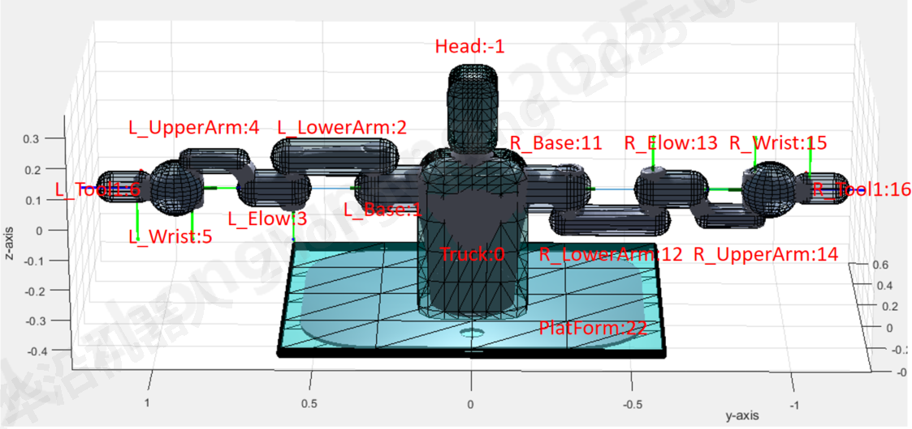

# 双臂安全专项接口功能文档 V3.0
## 更新日志
- 2025.08.20
  -双臂自碰撞接口初步封装
## 自碰撞接口说明
### 双臂模型碰撞体定义

### 碰撞体类型说明
- Capsule 
  - 碰撞体参数：start (x,y,z), end (x,y,z), radius, type
- Ball
  - 碰撞体参数：offset (x,y,z), radius, type
- Lozenge
  - 碰撞体参数：ref2local_frame (x,y,z,r,p,y), geometry (l,w,h,r), offset(x,y,z)。 
### 碰撞体ID定义
    Truck = 0,
    Head = -1,
    L_Base = 1,                // 基座 (相对Frame 1定义)
    L_LowerArm = 2,            // 下臂 (相对Frame 2定义)  
    L_Elbow = 3,               // 肘部 (相对Frame 3定义)  
    L_UpperArm = 4,            // 上臂 (相对Frame 4定义) 
    L_Wrist = 5,               // 腕部 (相对Frame 5定义)  
    L_Tool1 = 6,               // 末端工具1 (相对Tool系定义)
    L_Tool2 = 7,               // 末端工具1 (相对Tool系定义)

    R_Base = 11,                // 基座 (相对Frame 1定义)
    R_LowerArm = 12,            // 下臂 (相对Frame 2定义)  
    R_Elbow =13,               // 肘部 (相对Frame 3定义)  
    R_UpperArm = 14,            // 上臂 (相对Frame 4定义) 
    R_Wrist = 15,               // 腕部 (相对Frame 5定义)  
    R_Tool1 = 16,               // 末端工具1 (相对Tool系定义)
    R_Tool2 = 17,               // 末端工具1 (相对Tool系定义)

    PlatForm = 22,              //桌台
    （暂时未使用L_Tool2和R_Tool2）
### 双臂自碰撞模型初始化
void initDualArmAreaConstrainPackageInterface(
                              RTS_IEC_INT robType, 
                              RTS_IEC_LREAL dh[4], 
                              RTS_IEC_LREAL platformGeometry[13],
                              RTS_IEC_LREAL headGeometry[13],
                              RTS_IEC_LREAL truckGeometry[13], 
                              RTS_IEC_LREAL baseGeometry[7], 
                              RTS_IEC_LREAL lowerArmGeometry[7], 
                              RTS_IEC_LREAL elbowGeometry[7], 
                              RTS_IEC_LREAL upperArmGeometry[7], 
                              RTS_IEC_LREAL wristGeometry[4], 
                              DUALARM_AXISPOS_REF jointPos);

初始化双臂自碰撞模型的函数，用于配置机器人类型、Denavit-Hartenberg参数、碰撞模型配置和初始关节位置信息。

- 参数：
  - robType:机器人类型， 枚举值为 Elfin (0) 或 UR (1) 或 DualArm (2)。
  - dh:双臂机器人整机的 Denavit-Hartenberg 参数向量。
  - platformGeometry:机器人桌面平台碰撞体参数，碰撞体类型为：Lozenge。
  - headGeometry：机器人头部碰撞体参数，碰撞体类型为：Lozenge。
  - truckGeometry：机器人躯干碰撞体参数，碰撞体类型为：Lozenge。
  - baseGeometry: 机械臂基座碰撞体参数（左右手相同），碰撞体类型为：Capsule。
  - lowerArmGeometry：机械臂低臂碰撞体参数（左右手相同），碰撞体类型为：Capsule。
  - elbowGeometry：机械臂肘部碰撞体参数（左右手相同），碰撞体类型为：Capsule。
  - upperArmGeometry：机械臂上臂碰撞体参数（左右手相同），碰撞体类型为：Capsule。
  - upperArmGeometry：机械臂腕部碰撞体参数（左右手相同），碰撞体类型为：Ball。
  - jointPos：机械臂关节位置,(L_J1,L_J2,L_J3,L_J4,L_J5,L_J6,R_J1,R_J2,R_J3,R_J4,R_J5,R_J6)。
- 双臂机器人整体碰撞模型参数见dual_arm_collision.json文件。
### 初始化工具碰撞模型
extern RTS_BOOL setCPToolCollisonCapsuleShapeInterface(RTS_IEC_LINT toolIndex, RTS_IEC_LREAL startPoint[3], RTS_IEC_LREAL endPoint[3], RTS_IEC_LREAL radius);

初始化双臂工具碰撞模型，目前只支持Capsule类型碰撞模型。

-参数：
  - toolIndex：工具碰撞模型ID，其中： L_Tool1 = 6, R_Tool1 = 16；
  - startPoint：Capsule碰撞模型参数，具体见碰撞体类型说明；
  - endPoint：Capsule碰撞模型参数，具体见碰撞体类型说明；
  - radius：Capsule碰撞模型参数，具体见碰撞体类型说明；

### 更新机器人位置
void updateDualArmACAreaConstrainPackageInterface(DUALARM_AXISPOS_REF jointPositions, DUALARM_AXISPOS_REF jointVelocity);

每周期外部状态信息的更新函数，用于更新机器人的关节位置、TCP姿态信息以及运动速
度。
- 参数：
  - jointPositions:包含机器人更新后关节位置向量（2*6 共12 个自由度）。
  - jointVelocity:包含机器人更新后关节速度向量（2*6 共12 个自由度）。
### 查询碰撞检测结果
RTS_BOOL checkCPSelfCollisionInterface(RTS_IEC_LINT* colliderPair, RTS_IEC_LREAL* distance);

用于查询双臂机器人当前状态下的碰撞情况。
- 参数：
  - colliderPair：若机器人发生碰撞，则返回发生碰撞的碰撞对，若机器人未发生碰撞，则返回距离最小的碰撞对。
  - distance：若机器人发生碰撞，则返回0，若机器人未发生碰撞，则返回距离最小的碰撞对的距离值。
### 碰撞模型管理器
#### 删除碰撞模型
void removeDualArmCollisionModelInterface(collisionModelIndex id);
用于移除指定的碰撞模型。
  - 参数：
  - id：需要移除的模型 ID。
#### 查询碰撞模型
RTS_IEC_BOOL checkDualArmCollisionModelInterface(collisionModelIndex id);
用于检查指定的碰撞模型是否存在。
- 参数：
  - id：需要检查的模型 ID。
  - 返回值：RTS_TRUE（模型存在）/RTS_FALSE（模型不存在）。
### 碰撞对管理器
#### 增加碰撞对
void setDualArmCollisionPairInterface(collisionModelIndex id1, collisionModelIndex id2);
用于添加需要进行碰撞检测的碰撞对。
- 参数：
  - id1：碰撞对中第一个模型的 ID。
  - id2：碰撞对中第二个模型的 ID。
#### 删除碰撞对
void removeDualArmCollisionPairInterface(collisionModelIndex id1, collisionModelIndex id2);
用于移除指定的碰撞对。
- 参数：
  - id1：碰撞对中第一个模型的 ID。
  - id2：碰撞对中第二个模型的 ID。
#### 查询碰撞对
void checkDualArmCollisionPairInterface(collisionModelIndex id1, collisionModelIndex id2);
用于检查指定的碰撞对是否存在。
- 参数：
  - id1：碰撞对中第一个模型的 ID。
  - id2：碰撞对中第二个模型的 ID。
#### 注意
- 先有碰撞模型，后有碰撞对，在管理碰撞对之前，要确保存在相关的碰撞模型。
